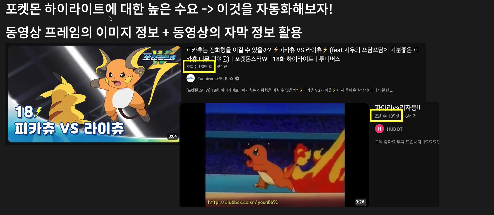
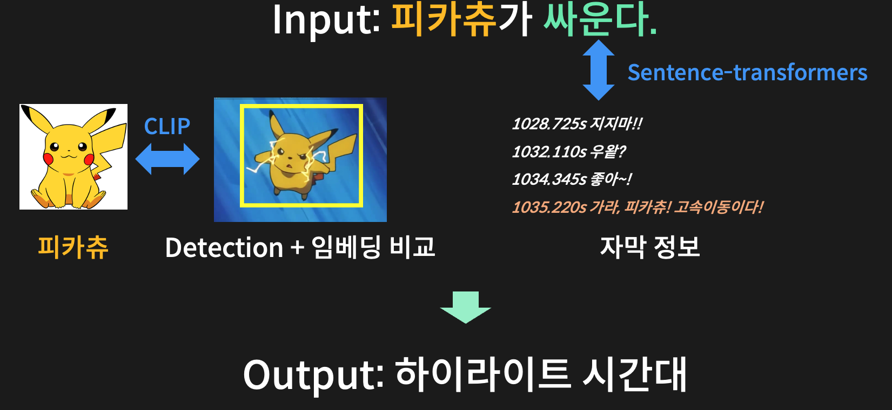

# Pokemon is All You Need

📢 2024년 2학기 [AIKU](https://github.com/AIKU-Official) 활동으로 진행한 프로젝트입니다

## 소개

누구나 마음 속에 좋아하는 포켓몬 하나쯤은 있다고 생각합니다. 

이제 귀찮게 하나하나 찾아다니지 말고, 자동으로 그 포켓몬이 나오는 장면만 뽑아봅시다. 

포켓몬 하이라이트 추출 Task를 다루는 프로젝트입니다! 

## 방법론

Input은 제시문으로 주어집니다.

과정은 두 트랙으로 구성됩니다. 

### 이미지 임베딩
1. 애니메이션의 모든 프레임에 대해서 Detection을 합니다.
2. 각 Detection된 바운딩 박스의 이미지의 임베딩을 CLIP의 Image Encoder를 통해 구합니다.
3. Input에서 포켓몬에 해당하는 단어를 찾아내고, 그 포켓몬 사진의 임베딩을 동일하게 CLIP의 Image Encoder를 통해 구합니다.
4. 임베딩 간의 유사도를 Cosine Similarity를 통해 구하고, 특정 threshold를 넘으면 해당 포켓몬이 있는 프레임으로 판단합니다.

### 자막 정보 활용 (문장 임베딩)
1. 제시문의 문장 임베딩을 Sentence Transformer를 통해 구합니다.
2. 애니메이션의 모든 자막에 대해서 문장 임베딩을 Sentence Transformer를 통해 구합니다.
3. 임베딩 간의 유사도를 Cosine Similarity를 통해 구하고, 특정 threshold를 넘으면 제시문에 해당하는 시간대인 것으로 판단합니다.

### 병합
이미지 임베딩으로 나온 프레임들의 시간대와 문장 임베딩으로 나온 자막의 시간대를 활용하여,

최종 하이라이트를 애니메이션에서 추출합니다.

## 환경 설정

이미지 임베딩: [open_clip](https://github.com/mlfoundations/open_clip)

문장 임베딩: [sentence_transformers](https://sbert.net/)

두 라이브러리를 참고하여 구성

## 사용 방법

비교할 애니메이션 데이터가 여기에 없기 때문에 구동할 수는 없지만,

데이터가 존재하고 이미지 임베딩과 문장 임베딩을 미리 다 구해놓았다면 pipeline.ipynb에서 user_input에 제시문을 넣고 차례로 실행하면 됩니다.

## 예시 결과
Input: **피카츄가 싸운다.**

  
  
  

## 팀원
- [이창엽](https://github.com/PROLCY): 팀장, 이미지 임베딩
- [권도영](https://github.com/douyoung89): Pokemon Detection, 자막 정보 활용
- [김민준](https://github.com/ddomjun): Pokemon  Detection, 자막 정보 활용
- [박무근](https://github.com/MooGeunPark): 데이터셋 수집, 자막 정보 활용